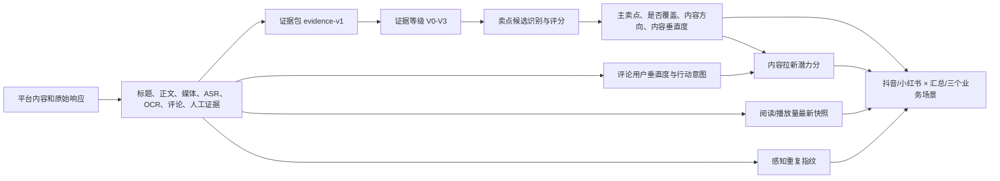

# DCar Insight v8.2 数据判定规则与算法说明

更新时间：2026-08-03（北京时间）

适用代码：当前 `main` 工作区中的 v8 实现

适用版本：报告 `dcar-content-operations-report-v8.2`、评估 `evaluation-v6`、证据 `evidence-v1`、卖点词表 `selling-points-v5.0`

## 1. 文档目的与阅读约定

本文说明的是**当前代码和当前数据库实际执行的判断规则**，不是未来方案，也不是只依据产品文档整理的理想口径。

需要先区分三类结果：

1. **真正的比例**：卖点条数占比、核心卖点条数占比、卖点曝光占比、核心卖点曝光占比；
2. **0—100 分的评分**：内容垂直度、互动用户垂直度、内容拉新效果预估；页面目前将这三项统一显示为 `%`，但底层含义是“分数”，不是条数比例；
3. **尚未建模的数量**：预估拉新人数、预估拉活人数、预估线索数，目前没有模型，不能由“内容拉新效果预估分”换算出来。

本文最后单列“当前实现边界与口径差异”。其中内容只是如实记录现状，不代表本文擅自修改业务规则。

## 2. 总体计算链路



单条内容先形成一条不可变评估版本；概览和报告再读取符合当前版本要求的评估、最新指标快照和重复关系进行聚合。

## 3. 时间、内容和版本选择规则

### 3.1 北京时间窗口

概览统一使用 `Asia/Shanghai`：

| 窗口 | 北京时间边界 | 查询规则 |
|---|---|---|
| 昨天 | 昨日 00:00 至今日 00:00 | 左闭右开 |
| 本周 | 本周一 00:00 至当前时刻 | 左闭右开 |
| 上周 | 上周一 00:00 至本周一 00:00 | 左闭右开 |

执行查询时，北京时间边界转换成 UTC ISO 时间，条件固定为：

```text
published_at >= period_start AND published_at < period_end
```

`published_at` 为空的内容不会进入昨天、本周或上周，也不会被强行归入某个日期。

报告任务的结束日期是包含日。例如任务选择 `2026-08-02` 至 `2026-08-02`，实际区间为北京时间 `[2026-08-02 00:00, 2026-08-03 00:00)`。

### 3.2 发布条数口径

- 一条平台作品 ID 对应一条发布内容；
- 相同创意由不同账号或不同作品 ID 发布，仍分别计入发布条数；
- 感知重复关系单独计算，不会从发布条数分母中删除重复内容；
- 缺失发布日期的内容只记录为“日期边界缺失”，不进入区间结果。

### 3.3 当前评估选择

概览只读取同时满足以下条件的评估：

1. `invalidated_at IS NULL`；
2. `rule_version = evaluation-v6`；
3. `taxonomy_version = 当前最新已发布卖点词表`；
4. 同一内容符合条件的评估按最大 ID 取最新一条。

旧规则、旧词表或已经失效的评估不会进入当前概览。

### 3.4 指标快照选择

每条内容按 `captured_at DESC, id DESC` 取最新一条指标快照。阅读/播放量是**抓取时累计值**，不是平台在内容发布当天的历史值，也不是报告区间结束时的冻结值。

因此，历史区间重新生成报告时，可能使用生成时能够取得的最新累计阅读/播放量；不能把该数值解释成历史日终值。

## 4. 证据包与重新评估规则

### 4.1 证据包组成

每条内容的 `evidence-v1` 由以下指纹组成：

| 组件 | 内容 |
|---|---|
| `detail_raw_sha256` | 最新作品详情原始响应；只认详情类 operation |
| `text_sha256` | 标题、正文、原账号 UID、原账号昵称的稳定哈希 |
| `media_sha256` | 最新媒体或媒体清单证据 |
| `asr_sha256` | 最新 ASR/转写证据 |
| `ocr_sha256` | 最新 OCR 证据 |
| `comments_version_sha256` | 最新评论证据版本 |
| `manual_evidence_sha256` | 当前内容全部人工证据的稳定哈希 |

以上组件共同计算 `evidence_sha256`。同一内容、同一规则版本、同一词表版本、同一 `evidence_sha256` 只能存在一条评估，数据库唯一约束阻止重复生成相同评估版本。

### 4.2 哪些变化会触发重新评估

会触发重新评估：

- 标题、正文、账号 UID 或昵称发生变化；
- 详情证据变化；
- 媒体、ASR、OCR 证据变化；
- 评论证据版本变化；
- 新增人工证据；
- 当前发布卖点词表版本变化。

不会作为内容证据触发重新评估：

- 单纯的阅读/播放、点赞、分享等实时指标刷新。

## 5. 证据等级 V0—V3

### 5.1 基础有效性

- ASR 可用：`status=success` 且中文字符数不少于 15；
- OCR 可用：`status=success`、中文字符数不少于 15，并且至少有 1 条 OCR 观察；
- 人工画面证据可用：证据类型为 `visual_summary` 或 `media_observation`，正文至少有 8 个中文字符；
- 媒体可用：实际媒体文件存在，或媒体清单声明为 `complete/partial` 且对应文件存在。

### 5.2 等级判断

| 等级 | 当前代码条件 | 自动卖点判断 | 自动内容垂直度 |
|---|---|---:|---:|
| V3 | 视频媒体存在，同时 ASR 和 OCR 均可用 | 是 | 是 |
| V2 | 媒体存在，且 ASR、OCR、人工画面证据至少一项可用；非视频内容有可用 OCR 也可达到 V2 | 是 | 是 |
| V1 | 没有达到 V2/V3，但标题或正文有文字 | 否 | 否 |
| V0 | 内容主体和有效文字都不可用 | 否 | 否 |

V0/V1 不是“卖点为 0”或“垂直度为 0”，而是证据不足，相关自动评分为空。

## 6. 卖点覆盖判断算法

### 6.1 “覆盖卖点”的完整条件

自动流程中，一条内容被判定为覆盖卖点，需要依次满足：

1. 证据等级为 V2 或 V3；
2. 根据标题、正文、ASR、OCR 命中至少一个卖点候选规则；
3. 对每个候选计算卖点评分；
4. 将候选按“分数从高到低、代码字典序从小到大”排序；
5. 第一名成为主卖点；
6. 主卖点评分不低于 75 分，`selling_point_included=true`。

伪代码：

```text
if evidence_level not in {V2, V3}:
    primary = null
    included = false
else:
    candidates = hardcoded_match(title + body + ASR + OCR)
    candidates += configured_positive_evidence_fallback(...)
    candidates = sort(candidates, score descending, code ascending)
    primary = candidates[0] if candidates else null
    included = primary exists and primary.score >= 75
```

### 6.2 文本预处理

匹配前会：

- 合并标题和正文；
- 读取 ASR 和 OCR；
- 统一一部分常见识别错误，例如“董车帝、懂车弟、总车帝”等归一成“懂车帝”，“ai小懂”归一成“AI小懂”；
- 正文匹配时去掉话题标签文本；
- 判断内容是否具有二手车主叙事；
- 评论、阅读量、账号类型不参与自动卖点表达判断。

当前 v8 调用卖点匹配器时没有传入独立的关键帧人工语义摘要；自动候选主要使用标题、正文、ASR 和 OCR。人工证据可以通过正式人工复核直接覆盖结论。

### 6.3 候选卖点评分

硬编码候选的基础公式为：

```text
卖点分 = 语义匹配 + 懂车帝承接 + 媒体证据 + 用户收益 + 主叙事突出度
```

| 维度 | 当前计算 |
|---|---|
| 语义匹配 | 当前已编码候选通常固定 30 分 |
| 懂车帝承接 | 内容明确出现“懂车帝、DCar、AI小懂”时 25 分；M 类卖点固定按 25 分；否则 18 分 |
| 媒体证据 | 候选词出现在 ASR/OCR：V3 为 20 分、V2 为 16 分；只出现在正文为 6 分 |
| 用户收益 | 默认 13 分；部分交易、价格、实测、安全处置等规则为 15 分 |
| 主叙事突出度 | 至少两个证据来源且含媒体来源为 10 分；一个媒体来源为 8 分；只有正文为 4 分 |

总分还受证据上限约束：

| 证据等级 | 分数上限 |
|---|---:|
| V3 | 100 |
| V2 | 90 |
| V1 | 74 |
| V0 | 0 |

即使内容整体达到 V2/V3，如果某个候选只在正文中出现、ASR/OCR 没有该候选的证据，该候选仍会被封顶为 74 分，不能自动计入正式卖点。

### 6.4 分数区间

| 主卖点分数 | 当前处理 |
|---|---|
| 90—100 | 强匹配，计入卖点覆盖 |
| 75—89 | 明确匹配，计入卖点覆盖 |
| 60—74 | 弱匹配，`pending_review=true`，不自动计入卖点覆盖 |
| 0—59 或无候选 | 不计入卖点覆盖 |

V0/V1 无论是否出现关键词，自动评估都不会生成正式卖点候选，并标记为待补证或待复核状态。

### 6.5 主卖点、次卖点和核心卖点

- 每条评估最多保存 3 个候选：第 1 个为主卖点，后 2 个为次卖点；
- 只有主卖点参与卖点条数、核心卖点条数和内容方向汇总；
- 次卖点用于明细证据，不参与渠道核心占比；
- 如果候选同分，当前 v8 最终按卖点代码字典序选择主卖点，例如同为 90 分时 `C1` 会排在 `X3` 前；
- 核心卖点必须同时满足：主卖点已正式覆盖，且当前发布词表中该卖点 `tier=core`。

当前核心卖点固定为：

```text
E1、E2、X1、X2、X3、M1、M2、M3
```

## 7. 当前 25 个卖点的实际候选规则

下表是对当前硬编码匹配条件的工程化摘要。表中的“需要懂车帝承接”表示规则本身明确要求出现懂车帝/DCar/AI小懂；未标注的不代表业务上不需要承接，只表示当前代码没有把它写成候选生成的硬门槛。

### 7.1 二手车 E 类

| 代码 | 层级 | 名称 | 当前候选触发条件 |
|---|---|---|---|
| E1 | 核心 | 专业收车、卖得高、到账快 | 已判为二手车叙事；出现收车、上门评估、高价卖车、卖车到账、专业收车之一；需要懂车帝承接 |
| E2 | 核心 | 靠谱二手车、透明车况和保障 | 已判为二手车叙事；出现认证/个人/商家车源、透明车况、平台保障、选车估价验车之一；需要懂车帝承接 |
| E3 | 其他 | 按预算和行情筛选高性价比二手车 | 已判为二手车叙事；出现明确预算金额、某金额以内、车型推荐、值得买、怎么选等；没有人群/场景词 |
| E4 | 其他 | 按人群和场景推荐二手车 | 满足 E3 类预算/推荐条件，同时出现新手、家庭、家用、女生、通勤、代步、宝妈等场景词 |
| E5 | 其他 | 检测报告、车辆档案或专业检测 | 已判为二手车叙事；视频/ASR/OCR 出现检测报告、车辆档案、车况报告、专业验车等；需要媒体中的懂车帝承接 |
| E6 | 其他 | 估价、保值率和市场行情 | 已判为二手车叙事；出现估价、保值率、成交行情、市场行情、历史价格、同一车源不同价格；需要懂车帝承接 |
| E7 | 其他 | 合同、过户、交易流程和权益 | 已判为二手车叙事；出现过户、交易合同、交易流程、权益保障；需要懂车帝承接 |

二手车叙事大致按以下规则判断：二手车相关词出现且不少于新车相关词；或者正文明确提到二手车，同时存在车况、里程、过户、车源、检测、验车、估价等支持信号。

### 7.2 新车 X 类

| 代码 | 层级 | 名称 | 当前候选触发条件 |
|---|---|---|---|
| X1 | 核心 | 同级候选车型多维对比 | 非二手车叙事；出现全面/横向/同级对比、二选一、选哪个、VS、PK；至少两款候选车；空间、动力、配置、油耗、续航、价格等维度至少命中 2 项 |
| X2 | 核心 | 权威测评和真实车主口碑 | 出现懂车帝实测、实测榜、权威测评、车主口碑、车主评价、长期测评；单独“懂车分”在销量主题中不触发 |
| X3 | 核心 | 最新车价、落地价、优惠和现车 | 识别出具体价格且附近有最新价、一口价、指导价、售价、落地价、优惠后、低至等当前价格提示；推测/网传价格不触发，除非同时有指导价、渠道价等已验证提示；懂车帝查询报价能力也可触发 |
| X4 | 其他 | 按预算、人群和场景选车 | 非二手车叙事；出现买什么车、车型推荐、怎么选车；或“预算”和选车词相邻；或新手、家庭、通勤等人群场景词与推荐/选车词相邻 |
| X5 | 其他 | 车型版本和配置差异 | 出现版本对比、配置对比、高低配、哪个版本、选装包、配置差异 |
| X6 | 其他 | 购车和长期用车成本 | 出现养车/用车成本、月供、保险油费、每公里成本等；并且有按年/月/公里、合计等计算信号，或至少两类成本项目 |
| X7 | 其他 | 验证参数、配置和营销话术 | 同时出现减配、虚标、智商税、参数/配置骗局等风险词，以及拆解、验证、实测、测试数据、实验等验证词 |
| X8 | 其他 | 定金、合同、选配、交付和权益 | 出现购车合同、定金、交付权益、购车权益、提车周期、选配合同；至少两个主题词，或一个强主题词同时配合注意、检查、流程、避坑、条款等指导词 |

### 7.3 AI 小懂 M 类

M 类有统一前置条件：内容必须明确出现“AI小懂”或“小懂助手”。

| 代码 | 层级 | 名称 | 在统一前置条件下的触发词 |
|---|---|---|---|
| M1 | 核心 | 预约试驾和试驾指南 | 预约试驾、试驾指南、试驾清单 |
| M2 | 核心 | 真实优惠、库存和现车 | 库存、现车、展车、试驾车、真实优惠 |
| M3 | 核心 | 洗车、维修保养和日常用车管理 | 洗车、维修保养、保养预约、车档案、用车账本 |
| M4 | 其他 | 自然语言选车和个性化推荐 | 选车、推荐、怎么选、对比 |
| M5 | 其他 | 故障解释和安全处置 | 故障、报警灯、异响、安全处置 |
| M6 | 其他 | 估价和卖车准备 | 估价、卖车 |

### 7.4 综合内容 C 类

| 代码 | 层级 | 名称 | 当前候选触发条件 |
|---|---|---|---|
| C1 | 其他 | 实用汽车知识和用车问题解答 | 视频语义不少于 15 个中文字符；出现保养、维修、故障、轮胎、刹车、驾驶技巧等汽车知识词；同时有怎么、如何、原理、步骤等教学信号，或至少命中 2 个知识主题；纯情感故事且没有明确教学/平台任务时排除 |
| C2 | 其他 | 车型细节、真实影像和场景化体验 | 视频语义不少于 15 个中文字符；出现内饰、外观、空间、后排、驾驶感受等车型体验词；同时出现实拍、体验、试驾等描述信号，或至少命中 2 个车型细节主题；纯情绪内容且没有实质展示时排除 |
| C3 | 其他 | 车友社区、用车交流和玩车内容 | 当前 v8 实际从 ASR 识别懂车帝玩车社区、趣玩车社区、车友圈；或玩车活动信号与懂车帝承接同时存在；泛车友社区还需同时出现交流、分享、改装、帖子等行为词 |
| C4 | 其他 | 新车发布和汽车行业动态 | 出现正式上市、正式发布、官图、预售、申报图、新车发布、销量榜、新款发布、发布会；概念车、AI设计、脑洞、机甲、末日等推测娱乐内容排除 |

## 8. 页面可配置卖点字段与实际执行关系

卖点页支持维护：标签名称、核心/其他层级、适用场景、定义、正向证据、负向证据、边界规则。

当前自动评估对这些字段的真实使用情况如下：

| 字段 | 当前是否参与自动判断 | 当前行为 |
|---|---:|---|
| `code` | 是 | 候选身份、排序、方向映射和汇总键 |
| `tier` | 是 | 判断是否为核心卖点 |
| `scenes` | 部分 | 人工 override 时校验卖点与内容方向是否兼容；自动 C 类方向仍使用代码中的固定逻辑 |
| `label` | 展示 | 用于页面和报告展示 |
| `definition` | 否 | 当前只存储和展示 |
| `positive_evidence` | 是，但仅作补充 | 对硬编码规则没有生成的卖点做简单子串匹配；命中 1 个词为 70 分、2 个为 80 分、3 个及以上封顶 90 分 |
| `negative_evidence` | 否 | 当前评估代码没有读取 |
| `boundary_rules` | 否 | 当前评估代码没有读取 |

截至本文更新时间，当前已发布 `selling-points-v5.0` 共 25 个卖点，所有 `positive_evidence`、`negative_evidence`、`boundary_rules` 都为空。因此当前自动卖点结果主要由上一节的硬编码条件产生。

发布新词表时，系统会将旧发布版标记为 retired，并生成新版本；评估会因为词表版本变化进入增量重算候选。

## 9. 覆盖的是哪个卖点：主卖点选择和方向归属

### 9.1 主卖点选择

1. 同一代码重复命中时保留最高分；
2. 汇总硬编码候选和可配置正向证据候选；
3. 按分数降序排列；
4. 同分按代码字典序排列；
5. 第一名为主卖点；
6. 后两名保存为次卖点；
7. 只有主卖点决定“覆盖哪个卖点”、是否核心以及自动内容方向。

### 9.2 自动内容方向

只要已经产生主卖点候选，即使候选分数低于 75、尚未正式计入卖点覆盖，自动方向也会先按该候选代码归类。

| 主卖点代码 | 自动方向 |
|---|---|
| E1—E7 | 二手车 |
| X1—X8 | 新车 |
| M1—M6 | 媒体-AI小懂 |
| C1 | 证据文本含“二手”则二手车，否则媒体-AI小懂 |
| C2 | 证据文本含“二手”则二手车，否则新车 |
| C3 | 媒体-AI小懂 |
| C4 | 当前自动代码固定为新车 |
| 无主卖点 | 沿用内容已有评估方向；仍无有效方向则 unknown |

概览最终内容方向优先级为：

```text
人工指定方向
→ 当前评估方向
→ 内容表已有评估方向
→ 账号内容方向
→ unknown
```

`other` 和 `unknown` 会进入渠道汇总及渠道总分母，但不会进入二手车、新车、媒体-AI小懂三个场景卡片。

## 10. 内容垂直度算法

### 10.1 单条内容是否出分

只有 V2/V3 内容自动计算 `content_automotive_score`。V0/V1 返回空，不用 0 分代替。

### 10.2 当前自动评分

系统在“标题 + 正文 + ASR + OCR”中检查一组汽车词，包括汽车、车型、新车、二手车、车价、买车、卖车、用车、试驾、驾驶、保养、维修、发动机、变速箱、轮胎、刹车、续航、油耗、配置、车主、底盘、车况、懂车帝、AI小懂。

每个词只计算“是否出现”，不按出现次数累加。

未正式覆盖卖点时：

| 命中的不同汽车词数量 | 内容垂直度分 |
|---:|---:|
| 0 | 8 |
| 1 | 48 |
| 2—3 | 74 |
| 4—6 | 86 |
| 7 个及以上 | 95 |

正式覆盖卖点时：

```text
content_score = max(88, min(100, 76 + 3 × 命中汽车词数量))
```

这意味着“是否覆盖卖点”会直接抬高内容垂直度，最低为 88 分。

人工复核可以将内容垂直度覆盖为 0—100 之间的指定分值；系统保存为新的人工评估版本，不覆盖历史版本。

## 11. 互动用户垂直度与行动意图

### 11.1 评论用户计分

每条已存储、具有匿名用户键且正文非空的评论，按文本规则生成两个分数。

互动用户汽车性：

| 用户评论信号 | 分数 |
|---|---:|
| 明确车主经历、购车/卖车/维修保养经历，或明确高行动购车意图 | 100 |
| 专业车型、配置、动力、油耗等汽车讨论，或明确的信息咨询 | 70 |
| 泛汽车词、简单汽车兴趣或弱场景信号 | 30 |
| 没有汽车相关信号 | 0 |

行动意图：

| 用户评论信号 | 分数 |
|---|---:|
| 明确提到去懂车帝查询、搜索、下载、打开、预约等动作 | 100 |
| 明确准备买、想买、求购、订车、询价、卖车、置换等高行动 | 80 |
| 询问配置、选择、油耗、续航、对比、是否靠谱等信息 | 50 |
| 无明确行动 | 0 |

### 11.2 单条内容出分门槛

- 同一内容内按匿名用户键去重；
- 评论刷新采用 upsert：同一匿名用户的新分值会覆盖旧分值，但本批没有再次出现的旧用户不会删除，因此当前用户集合是该内容跨批次累计保留的去重用户，不是严格的“最新一周用户样本”；
- 新供应商评论入库时固定以 `context_automotive=true` 执行评论规则，不会先根据该条内容的汽车性决定是否启用汽车上下文；
- 少于 20 名有效去重评论用户：互动用户垂直度和行动意图都为空；
- 达到 20 人：分别对全部用户分数做算术平均并四舍五入；
- 不建立跨内容用户画像。

### 11.3 渠道和场景聚合

概览先得到每条内容的互动用户垂直度，再对有分内容做**等权平均**。它不是把一个渠道的全部评论用户重新放在一起加权，也不会让评论较多的内容自动获得更高权重。

## 12. 内容拉新效果预估

当前“内容拉新效果预估”是 0—100 的实验前潜力分，不是新增人数。

单条内容公式：

```text
拉新潜力分
= 20% × 内容垂直度
+ 25% × 互动用户垂直度
+ 35% × 懂车帝卖点适配分
+ 20% × 行动意图分
```

卖点适配分规则：

- 已正式覆盖卖点：使用主卖点评分；
- 内容垂直度可计算但未覆盖卖点：取 0；
- 内容垂直度不可计算：拉新潜力为空。

互动用户垂直度、卖点适配分或行动意图任一缺失时，拉新潜力为空；系统不补 0、不重新分配权重。

渠道和场景的“内容拉新效果预估”是所有非空单条拉新潜力分的算术平均值。

## 13. 重复内容判断与重复提醒

### 13.1 指纹组成

每条内容生成：

- 标题和正文标准化后的 SHA-256；
- 本地媒体文件字节 SHA-256；
- 图片 pHash；
- 视频在 10%、30%、50%、70%、90% 时间点抽帧后的 pHash；
- 标题正文、ASR、OCR 各自的 64 位 SimHash。

文本标准化只保留中文、英文字母和数字并转小写；不足 12 个标准化字符时不生成对应 SimHash/正文 SHA 判定项。

媒体清单最多读取前 8 个实际媒体文件。无效、过于单一的 pHash 会被丢弃。

### 13.2 确认重复的四条路径

满足任意一条即确认重复：

1. 至少一个本地媒体文件字节 SHA-256 完全相同；
2. 标准化标题正文 SHA-256 完全相同；
3. 双方都有至少 2 种不同视觉帧、至少匹配 3 帧，平均 pHash 距离不大于 3；
4. 至少匹配 2 帧、平均 pHash 距离不大于 6，并且标题正文/ASR/OCR 的最高 SimHash 相似度不低于 0.84。

纯 ASR 或纯 OCR 相似不能单独确认重复，必须同时具备视觉近似证据；这是为了降低相似汽车口播造成的误报。

### 13.3 定标发布门槛

重复规则只有在冻结定标集通过后才允许发布重复关系：

- 定标对数必须正好 150 对；
- 75 对重复、75 对不重复；
- 精确率必须不低于 95%；
- 当前定标结果为精确率 100%、召回率 98.6667%，状态 passed。

### 13.4 原内容选择

所有确认边通过连通关系组成重复簇。该规则具有传递性：如果 A 与 B 确认重复、B 与 C 确认重复，A/B/C 会进入同一簇，即使 A 与 C 没有直接命中。每个簇中：

1. 优先选择 `published_at` 最早的内容为原内容；
2. 缺失发布日期时回退 `imported_at`；
3. 时间仍相同则内容数据库 ID 较小者优先。

原内容不显示重复提醒；其余内容显示原内容的六位链接 ID。

## 14. 渠道汇总和三个业务场景的七项指标

固定渠道：抖音、小红书。

固定场景：二手车、新车、媒体-AI小懂。

### 14.1 卖点条数占比

```text
卖点条数占比 = selling_point_included=true 的内容数 ÷ 渠道窗口内全部发布数
```

- 渠道汇总：分子为整个渠道的卖点内容数；
- 场景：分子只统计该场景的卖点内容；
- 场景分母仍然是整个渠道发布数，不是场景发布数；
- 渠道有内容时直接发布该比例，当前不受证据覆盖率门槛阻断。

### 14.2 核心卖点条数占比

```text
核心卖点条数占比
= selling_point_included=true 且主卖点 tier=core 的内容数
÷ 渠道窗口内全部发布数
```

场景仍以整个渠道发布数为分母。

### 14.3 卖点曝光占比

```text
卖点曝光占比
= 卖点内容的有效阅读/播放量之和
÷ 渠道全部有效阅读/播放量之和
```

有效曝光定义为 `view_count > 0`。

发布该数值前必须满足：

```text
同时具有 view_count > 0 且 evidence_level ∈ {V2,V3} 的内容数
÷ 渠道全部发布数
>= 90%
```

并且渠道有效总曝光必须大于 0。未达到时返回 `below_threshold`，分子和百分比为空，不能以 0% 代替。

场景分子只取该场景卖点内容的曝光，分母仍为整个渠道有效总曝光。

### 14.4 核心卖点曝光占比

```text
核心卖点曝光占比
= 核心主卖点内容的有效阅读/播放量之和
÷ 渠道全部有效阅读/播放量之和
```

使用与卖点曝光占比相同的 90% 交叉覆盖门槛和渠道分母。

### 14.5 内容垂直度

- 渠道汇总：渠道中所有非空单条内容垂直度的算术平均值；
- 场景：该场景所有非空单条内容垂直度的算术平均值；
- 四舍五入为整数；
- 底层单位是 `point/100`，不是条数占比。

### 14.6 互动用户垂直度

- 对所有非空单条互动用户垂直度做等权算术平均；
- 不按评论用户数加权；
- 四舍五入为整数；
- 底层单位是 `point/100`。

### 14.7 内容拉新效果预估

- 对所有非空单条拉新潜力分做等权算术平均；
- 四舍五入为整数；
- 底层单位是 `point/100`；
- 不能解释成“预计带来多少人”。

## 15. 指标状态判断

### 15.1 七项渠道结论

| 状态 | 含义 |
|---|---|
| `available` | 满足发布条件，可以展示正式数值 |
| `below_threshold` | 有部分数据，但覆盖率没有达到发布门槛，不发布正式数值 |
| `sample_only` | 评分只有部分内容可计算，展示样本平均及覆盖率，不能代表全部内容 |
| `not_applicable` | 当前窗口或场景没有适用内容 |
| `missing` | 有内容，但没有任何内容满足该评分证据门槛 |
| `not_calculable` | 业务上需要模型，但当前版本没有模型或必要输入缺失 |
| `stale` | 数值来自历史快照，不能解释为当前实时值 |

条数占比：渠道无内容为 `not_applicable`；渠道有内容即为 `available`。即使某场景 0 条，只要渠道有内容，该场景结果仍可显示 `0 / 渠道总数`。

曝光占比：无内容为 `not_applicable`；达到 90% 交叉覆盖且总曝光大于 0 为 `available`；否则为 `below_threshold`。

三个评分：无内容为 `not_applicable`；全部无分为 `missing`；全部有分为 `available`；部分有分为 `sample_only`。

### 15.2 概览顶部整体指标

- 整体内容垂直率：`V2/V3 且 content_automotive_score >= 60 的内容数 ÷ 全部发布数`；
- 整体卖点覆盖率：`selling_point_included=true 的内容数 ÷ 全部发布数`；
- 两项均以 V2/V3 评估覆盖达到 95% 作为正式发布门槛；
- 整体重复率：确认重复的内容数 ÷ 全部发布数；需要定标通过且当前版本指纹覆盖达到 95%。

这里的“整体内容垂直率”是条数比例，而渠道卡片中的“内容垂直度”是平均分，两者不是同一个指标。

## 16. 其他数量数据

| 数据项 | 当前计算 |
|---|---|
| 发布内容数 | 时间窗口内内容条数 |
| 发布账号数 | 窗口内 `account_id` 非空的去重账号数；未关联账号不计入 |
| 阅读/播放总量 | 每条内容最新快照的 `view_count` 求和 |
| 评论总量 | 每条内容最新快照中非空 `comment_count` 求和；历史 `valid_unique_commenters` 不转换成评论数 |
| 预估拉新人数 | 当前没有已验证模型，恒为不可计算 |
| 预估拉活人数 | 当前没有已验证模型，恒为不可计算 |
| 预估线索数 | 当前没有已验证模型，恒为不可计算 |

## 17. 人工复核规则

### 17.1 自动进入待复核的判断标记

以下情况会在评估结果中设置 `pending_review=true`：

- 证据为 V0/V1；
- 主卖点评分为 60—74。

媒体处理在当日 07:30 截止点仍不完整时，也会进入 `media_processing_incomplete` 人工路由。

需要区分两个概念：评估结果中的 `pending_review=true` 是判断标记；`review_queue` 是运营可以实际操作的队列。当前新评估函数会写判断标记，但不会为每条新灰区自动创建 `evaluation_gray_zone` 队列；存量灰区队列主要由迁移生成，媒体不完整队列由截止任务生成。

### 17.2 可执行的人工决定

| 决定 | 结果 |
|---|---|
| `confirm` | 确认当前自动判断，清除待复核状态 |
| `override` | 指定主卖点、卖点分、是否覆盖、内容方向、内容垂直度中的一个或多个字段 |
| `insufficient_evidence` | 人工确认现有证据不足，结果为 V1，不输出正式卖点和内容垂直度 |
| `terminal_unavailable` | 人工确认内容永久不可用，结果为 V0，队列进入终态失败 |

人工 override 同时指定主卖点和内容方向时，方向必须属于当前词表中该卖点允许的场景集合。

复核必须提供复核人、理由和人工证据；人工证据进入证据包并产生新的 `manual_review` 评估版本。旧评估和旧复核记录保留，不原地覆盖。

提交复核时会检查 `base_evaluation_id`。如果运营打开工作台之后证据已经变化并生成了新评估，旧页面提交会被拒绝，要求刷新后重新判断。

首个 v8.2 正式报告生成前，仍处于 pending、manual_required 或 in_review 的 `evaluation_gray_zone` 会阻断报告。该闸门只用于首个正式 v8.2 revision；已有正式 revision 后不会重复执行首发闸门。

## 18. 报告任务的数据质量门槛

任务只有全部必需项达标才为 `succeeded`；任一项低于门槛为 `partial`。

| 数据质量项 | 当前计算 | 门槛 |
|---|---|---:|
| 发现覆盖 | 当前报告代码固定写为 100% | 100% |
| 详情覆盖 | 成功详情槽覆盖内容数 ÷ 报告内容数 | 98% |
| 指标新鲜度 | 仍在发布后 30 日监控期、且 36 小时内有可用快照的内容数 ÷ 应监控内容数 | 90% |
| 评估覆盖 | 当前规则/词表且证据为 V2/V3 的内容数 ÷ 报告内容数 | 95% |
| 核心产物覆盖 | 当前报告代码固定写为 100% | 100% |
| 媒体终态覆盖 | V2/V3，或已进入人工/解决/终态失败路由的内容数 ÷ 报告内容数 | 95% |
| 重复指纹覆盖 | 定标通过后，当前版本指纹覆盖数 ÷ 报告内容数 | 95% |
| 周报评论覆盖 | 近 8 日有可用评论证据的内容数 ÷ 周报内容数 | 90% |

指标状态中的 `below_threshold/sample_only` 与任务状态中的 `partial` 是两层概念，不能混用。

## 19. 当前实现边界与口径差异

以下内容是扫描当前代码后确认的事实，理解数据时需要保留：

1. **卖点页的配置不是当前唯一规则源。** 当前 25 个已发布卖点的正向证据、负向证据、边界规则均为空；自动匹配主要来自 `label_douyin_video_evidence_v3.py` 的硬编码条件。
2. **负向证据和边界规则目前没有进入自动评估。** 页面可以保存，但当前 `evaluation-v6` 不读取它们。
3. **部分硬编码候选不要求显式懂车帝承接。** 未明确出现懂车帝时，承接维度仍给 18 分而不是 0 分；在媒体证据充分时，泛汽车任务仍可能达到 75 分以上。这是当前代码口径，不等于“普通汽车内容天然就是懂车帝卖点”的业务原则。
4. **当前内容垂直度是关键词分档。** 它不是多模态模型，也没有执行 v5 文档中“正文与媒体加权、评论正负 5 分校准”的完整方案。
5. **自动评估设置 `pending_review`，但新评估函数本身不会为所有新灰区自动插入 `evaluation_gray_zone` 队列。** 存量灰区队列主要由迁移生成；媒体不完整队列由截止任务生成。
6. **概览与报告的方向优先级存在差异。** 概览人工方向优先；报告有当前评估时优先使用评估方向。
7. **渠道卖点条数指标没有 95% 证据覆盖闸门。** 渠道有发布内容时就会显示占比；证据覆盖率作为旁注展示。概览顶部整体卖点率和正式报告则有 95% 评估覆盖门槛。
8. **渠道七项中的卖点分子直接读取 `selling_point_included`。** 自动路径只会在 V2/V3 设为真，但人工 override 可以将低证据等级内容设为覆盖；渠道聚合不会再次过滤证据等级。
9. **最新累计指标不是历史时点快照。** 概览和报告可能使用区间结束以后采集的最新阅读/播放量。
10. **概览评论总量状态存在实现不一致。** 当前 API 在有内容时把评论总量状态写成 `missing`，即使快照中已有非空评论数；报告端则按 90% 覆盖判断。
11. **报告发现覆盖和核心产物覆盖当前固定为 100%。** 这两个字段目前不是根据数据库实时计算。
12. **页面将后三项评分显示为百分号。** 底层合同单位仍是 `point`、满分 100；不要与条数占比混淆。
13. **存量评分与新增评分来源不同。** 776 条迁移内容直接继承 `migrated_from_v5` 结果；只有证据、规则、词表变化或人工复核后产生的新评估，才使用本文描述的 `evaluation-v6` 自动算法。当前库内可能同时看到两种来源。
14. **评论用户集合不是严格周快照。** 评论用户分按内容和匿名用户键累计 upsert，旧用户不会因为新一批评论未出现而删除；互动用户垂直度可能基于跨批次累计样本。
15. **重复簇采用传递聚类且没有算法灰区。** 任意确认边会参与连通聚类，当前算法命中后直接写 confirmed，没有自动生成 `pending_review` 重复关系的路径。

## 20. 抓取失败、缺失和终态规则

- 同一内容、同一抓取阶段、同一业务时间窗只有一个抓取槽；成功槽不得重复付费调用；
- `pending` 和 `retryable_failed` 可以继续认领；`running` 和 `succeeded` 不能重复认领；`terminal_failed` 只有明确的人工重试入口才允许再次尝试；
- HTTP 400、404、410、422，以及 401/403 鉴权失败，按终态处理；
- HTTP 402 余额不足、408、429、5xx，以及超时、DNS、连接和 TLS 临时错误，按可重试处理；
- 供应商明确返回内容不存在或永久不可访问时记为 `content_unavailable/terminal_failed`；
- 抓取失败不能以 0 写入阅读量、评论量、卖点分或垂直度；相应数据保持空值并携带失败/缺失状态；
- `published_at` 为空的内容记入任务的 `excluded_missing_boundary`，不进入任何时间区间。

## 21. 两个计算示例

### 21.1 卖点覆盖示例

某条 V3 视频在 ASR 中明确出现“懂车帝”和“查看最新落地价”，并识别到具体当前价格，触发 X3：

```text
语义匹配 30
+ 懂车帝承接 25
+ V3 媒体证据 20
+ 用户收益 15
+ 主叙事突出度 8 或 10
= 98 或 100
```

结果：X3 为主卖点、计入卖点覆盖、计入核心卖点覆盖、自动归入新车场景。

如果同样的价格信息只出现在正文，ASR/OCR 没有对应证据，候选分会被封顶为 74，进入弱匹配复核，不自动计入覆盖。

### 21.2 场景占比示例

某渠道窗口共发布 100 条，其中二手车场景 30 条，二手车场景内有 12 条正式覆盖卖点、8 条为核心主卖点：

```text
二手车场景卖点条数占比 = 12 / 100 = 12%
二手车场景核心卖点条数占比 = 8 / 100 = 8%
```

这里不是 `12 / 30` 和 `8 / 30`，因为当前概览把场景指标定义为“该场景对整个渠道的贡献”。

## 22. 主要实现位置

- 时间窗口、当前评估和最新快照：`src/dcar_eval/v8/api.py`
- 渠道/场景七项指标：`src/dcar_eval/v8/insights.py`
- 证据包、证据等级、卖点评估、内容垂直度、复核：`src/dcar_eval/v8/evaluation.py`
- 硬编码卖点候选和评分：`src/dcar_eval/label_douyin_video_evidence_v3.py`
- 评论用户与行动意图：`src/dcar_eval/analyze_douyin_tikhub_v6.py`
- 拉新潜力公式：`src/dcar_eval/three_proposition_scoring.py`
- 感知重复识别：`src/dcar_eval/v8/duplicates.py`
- 报告质量门槛与汇总：`src/dcar_eval/v8/reports.py`
- 指标与任务合同：`config/report_contract_v8.json`
- 当前卖点源文件：`config/business_selling_points_v4_final.json`
- 产品规则基线：`config/懂车帝内容评估判断标准与流程_v5_终版.md`
